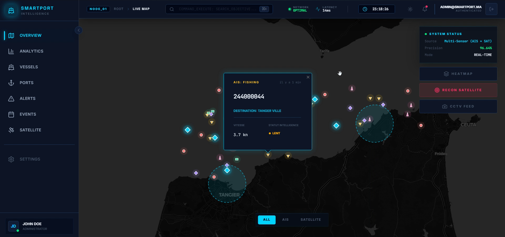
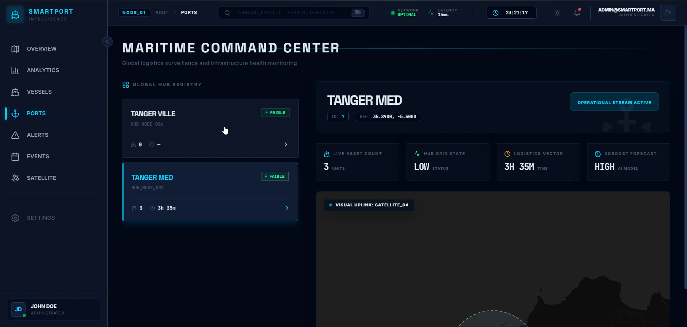
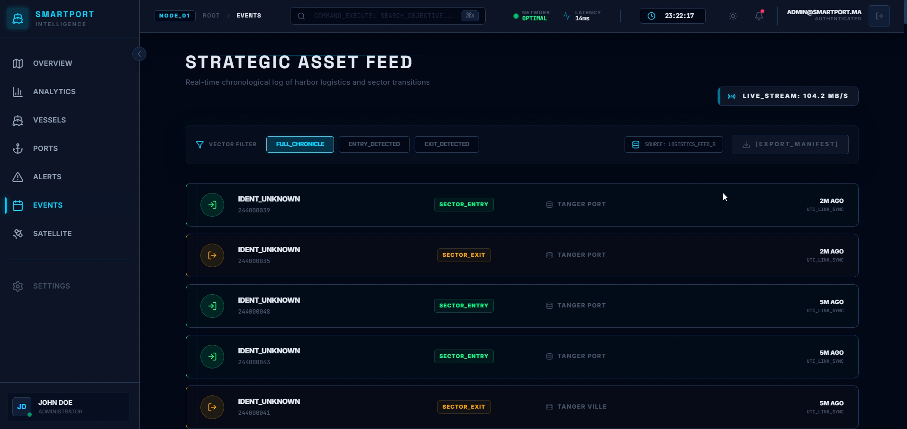
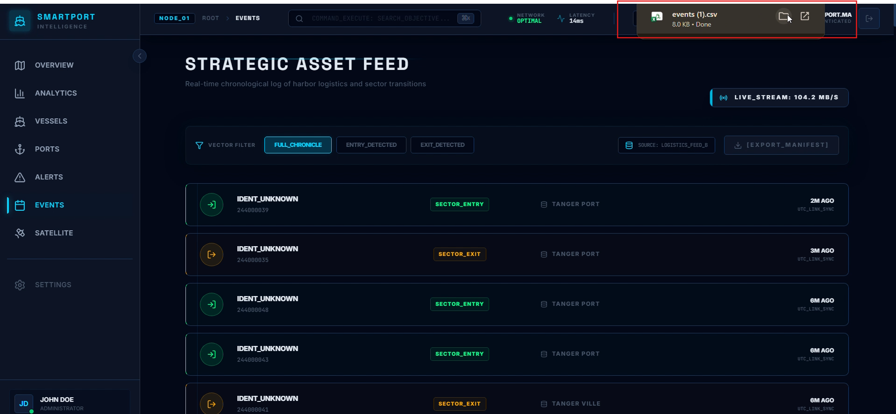
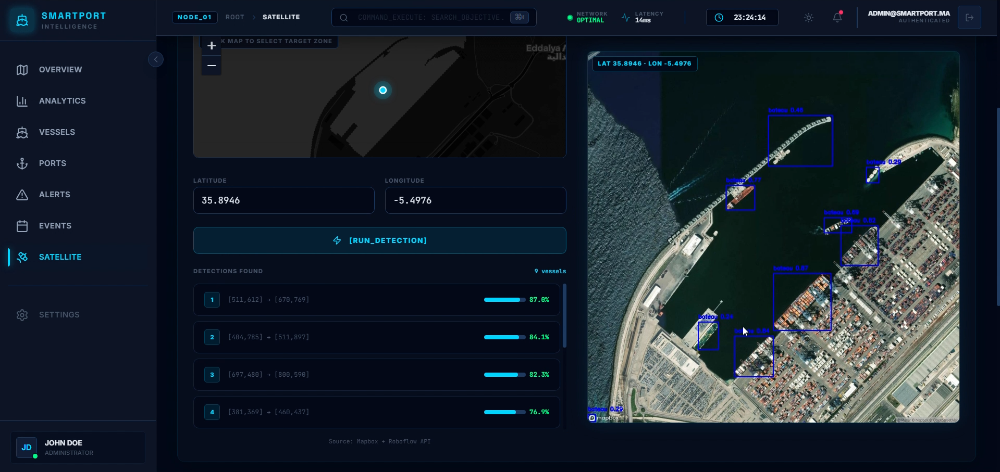
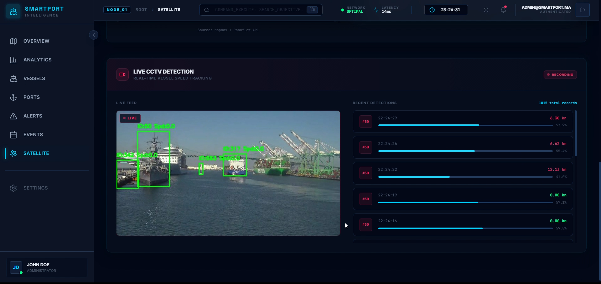
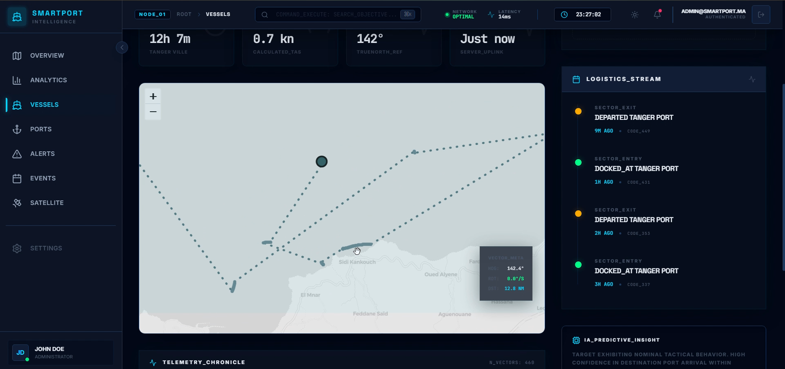
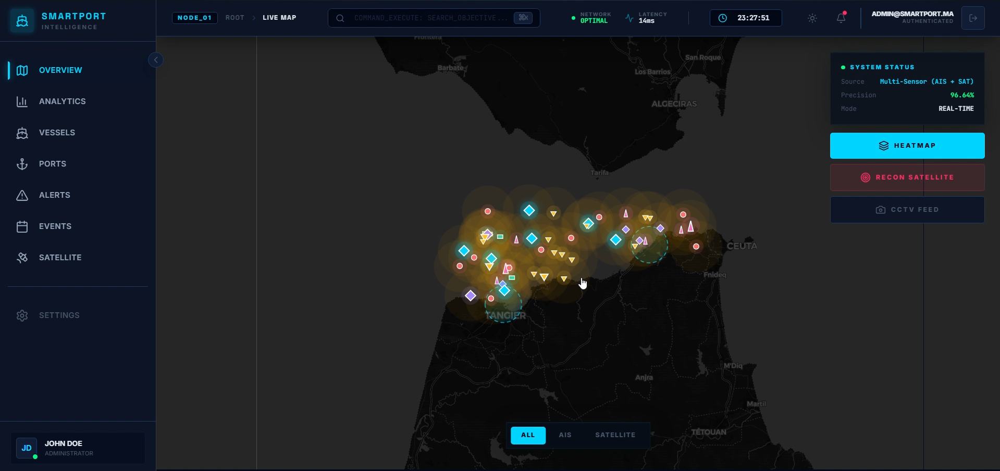

<h1 align="center">⚓ SMARTPORT INTELLIGENCE</h1>

<p align="center">
  <strong>Next-Generation Maritime Surveillance & Port Management Platform</strong>
</p>

<p align="center">
  
  
  
  
  
  
  
  
</p>

<p align="center">
  A state-of-the-art maritime intelligence system combining real-time AIS tracking, satellite imagery fusion, and AI-driven predictive analytics. Monitor port congestion, vessel movements, and detect maritime anomalies with high-precision vision and machine learning.
</p>

---

## 📸 Platform Preview

### 🛰️ Live Map & Dashboard
> Real-time vessel tracking with AIS & satellite data fusion on an interactive Leaflet map. Multi-sensor overlay with heatmap, satellite recon, and system status integration.



### 📊 Strategic Intelligence (Analytics)
> Advanced analytics with custom SVG charts, animated gradient donut charts, XGBoost AI forecasting gauge, and real-time KPI monitoring.




### 🚢 Maritime Asset Registry (Vessels)
> Complete fleet management with sortable data tables, status filters, real-time speed/position tracking, and sensor source verification (AIS/Satellite).



### 📍 Maritime Command Center (Ports)
> Port-level deep dive with live asset counts, congestion states, XGBoost prediction models, and embedded satellite map view with fly-to animations.



### 🚨 Strategic Threat Intel (Alerts)
> AI-powered anomaly detection with confidence scores, severity classification (Critical/Kinetic/Sector), and actionable threat response protocols.



### 🛰️ Satellite reconnaissance
> Orbital detection feeds with multi-spectral imaging, SAR/optical satellite imagery analysis, and automated vessel identification via YOLOv8.



### 🔐 Secure Authentication
> Military-grade login terminal with animated glitch effects, particle backgrounds, and encrypted access control.



---

## 🛠️ Technology Stack

### Frontend (Intelligence Core)
- **Framework**: React 19 + TypeScript 5.8
- **Build Tool**: Vite 8 (Ultra-fast HMR)
- **Styling**: Tailwind CSS 4 (Modern utility-first with CSS variables)
- **Animations**: Framer Motion 12 (Physics-based layout transitions)
- **Mapping**: Leaflet + React-Leaflet (Custom maritime layers)
- **State Management**: Zustand + TanStack Query (Auto-refetching & caching)
- **Icons**: Lucide React

### Backend (Security & AI Engine)
- **Framework**: Django REST Framework (DRF)
- **Database**: PostgreSQL with **PostGIS** for spatial maritime queries
- **Computer Vision**: **YOLOv8** (Object detection for satellite & video feeds)
- **Predictive Analytics**: **XGBoost** (Port congestion & ETA forecasting)
- **Communication**: WebSockets for real-time AIS stream processing
- **Environment**: Python 3.11+

---

## 🏗️ Project Architecture

```
Smart Port Ai/
├── FRONT_END_SMARTPORT_INTELLIGENCE/  # Frontend Intelligence App
│   ├── src/
│   │   ├── api/          # Axios clients (Vessels, Alerts, Satellite...)
│   │   ├── components/   # UI System (Glassmorphism, 3D Tilt, Neon Glow)
│   │   ├── pages/        # Dashboard, Analytics, Vessels, Ports, Alerts...
│   │   └── store/        # Zustand State (Auth, Theme, Live Feeds)
│   └── public/           # Static assets
├── Smart_port_Ai/                     # Backend Security Engine
│   ├── ais/            # AIS stream processing
│   ├── detection/      # YOLOv8 vessel detection service
│   ├── analytics/      # XGBoost prediction engine
│   ├── bateaux/        # Vessel registry management
│   ├── events/         # Entry/Exit event logger
│   └── manage.py       # Django CLI
└── docs/screenshots/   # Platform Visual Assets
```

---

## 🚀 Deployment & Installation

### 1. Prerequisites
- **Node.js**: 20.x or later
- **Python**: 3.11.x or later
- **PostgreSQL**: With PostGIS extension

### 2. Frontend Setup
```bash
cd FRONT_END_SMARTPORT_INTELLIGENCE/frontend
npm install
npm run dev
```
App will launch at `http://localhost:5173`. By default, it uses **Mock Data** for demonstration. To use the real API, toggle `USE_MOCK = false` in `src/api/client.ts`.

### 3. Backend Setup
```bash
cd Smart_port_Ai/Smart_Port_Ai
python -m venv venv
source venv/bin/activate  # On Windows: venv\Scripts\activate
pip install -r requirements.txt
python manage.py migrate
python manage.py runserver
```
Backend will launch at `http://127.0.0.1:8000`.

---

## 🌟 Key Features
- **Real-Time AIS Fusion**: Merging transponder data with computer vision detections.
- **AI Congestion Forecasting**: Using XGBoost to predict port traffic 24h in advance.
- **Orbital Reconnaissance**: Automated satellite imagery analysis for unidentified vessels.
- **Threat Intelligence**: Real-time alerts for zone intrusions and speed violations.
- **High-Fidelity UI**: Glassmorphism, 3D tilt effects, and 60fps animations.

---

## 📄 License
MIT License. See [LICENSE](LICENSE) for details.

---

<p align="center">
  <sub>Built with precision for maritime intelligence operations.</sub>
</p>

